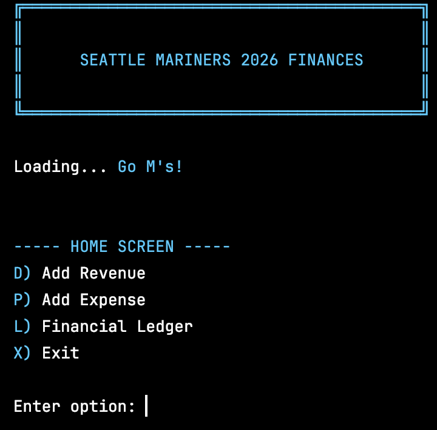
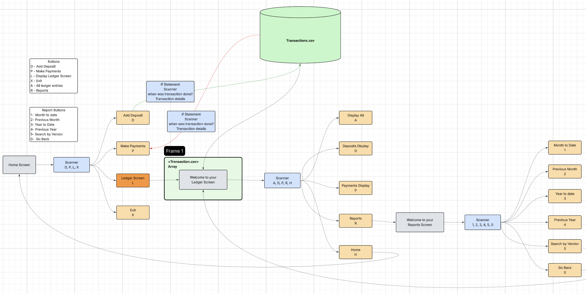
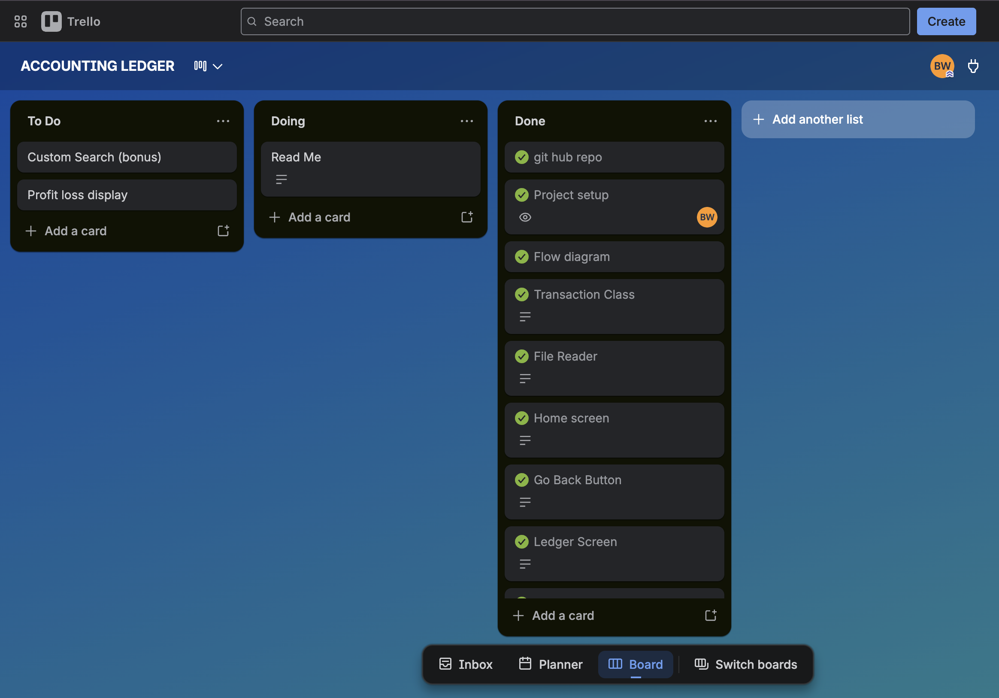
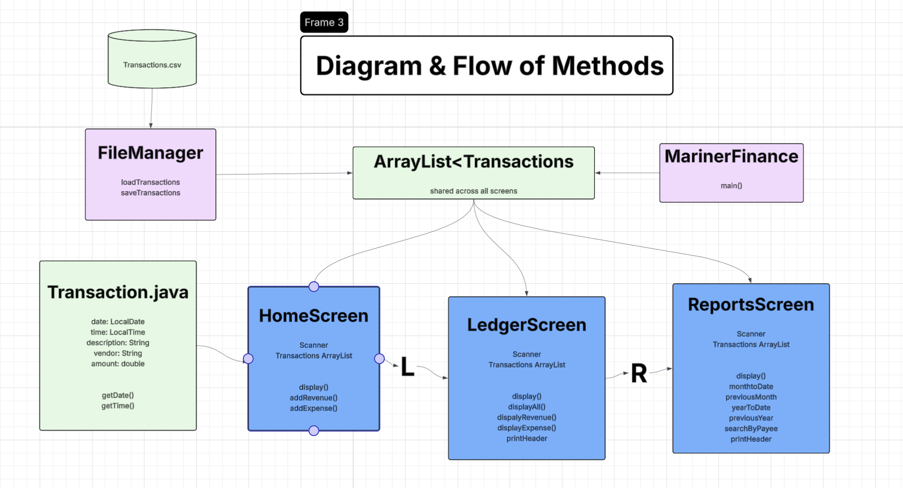
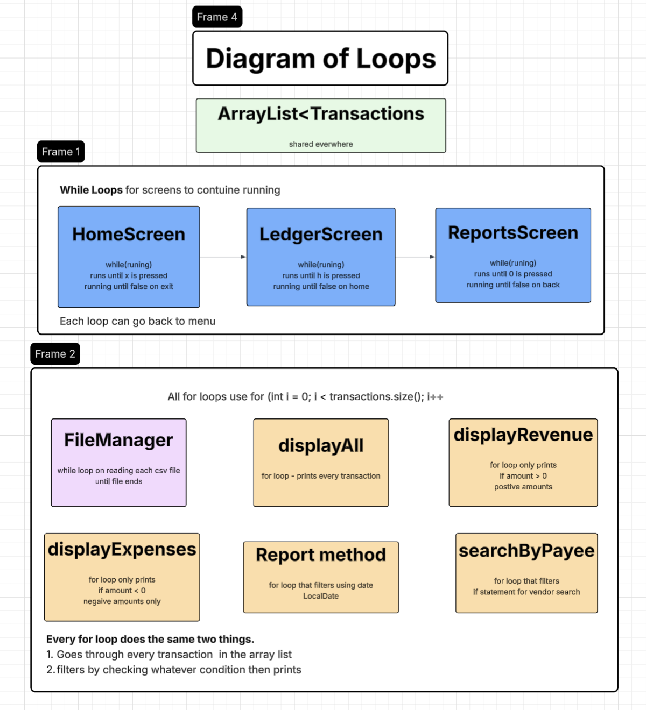
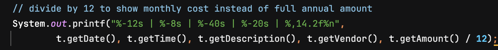
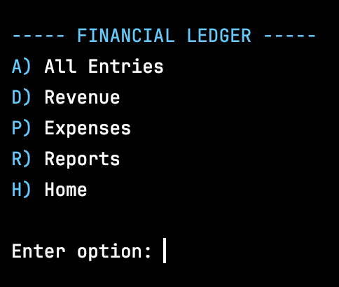
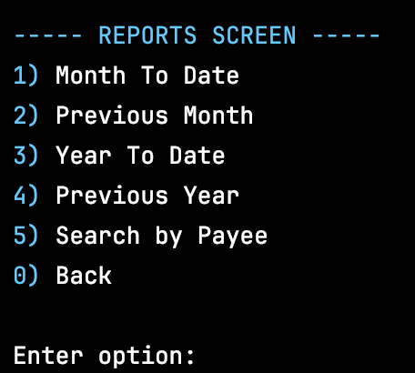

# Seattle Mariners 2026 Finances
#### A CLI accounting ledger app built around the Seattle Mariners front office finances.

## How to Run
1. Clone the repo from GitHub
2. Open the project in IntelliJ IDEA
3. Make sure `transactions.csv` is in the project root directory
4. Run `MarinersFinance.java`

## The Design Process
Before writing any code I mapped out the full app flow in Lucidchart, every screen, 
every button, and how they connect to each other. The biggest architectural decision 
I made was loading the `transactions.csv` file once at startup into an 
`ArrayList<Transaction>` and passing that same list to every screen. No screen ever 
reads the file directly, they all filter the in-memory list and only write back to 
the CSV when a new transaction is added.

I themed the app around the Seattle Mariners front office. Player contract payments 
use real 2026 salary data pulled from FanGraphs, and revenue entries include realistic 
MLB broadcasting deals, sponsorships, and ticket sales.

## Interesting Code
The most interesting decision I made was in the Month To Date and Previous Month 
reports. The salaries in the CSV are stored as full annual amounts so Luis Castillo 
shows up as -$24,150,000. But when you're looking at a monthly report that number 
doesn't make sense. So I added a single line that divides the amount by 12 to show 
the actual monthly cost.

The cool thing is I had two ways to solve this. Option A was what I did, just divide 
by 12 on the display side, one line change, data stays the same in the CSV. Option B 
would have been restructuring the entire CSV so each player has 12 separate monthly 
entries spread across the year which would have been way more accurate but a ton more 
work and a lot more rows to manage.

I went with Option A because it was clean, made sense for the scope of the project, 
and honestly it taught me something real. Sometimes the simplest solution is the 
right one. One line of code vs rebuilding your entire data structure.

## Biggest Challenge
Architecture was the biggest challenge. Early on I was calling the CSV from multiple 
screens every time a button was pressed. After speaking with Gregor I realized that 
was bad practice, you should load the data once and pass it around, not keep hitting 
the file. Omar pushed me to completely revamp the structure so that if I ever needed 
to change the file format I could do it in one place without breaking everything. That 
conversation changed how I thought about the whole app.

The -2.415E7 scientific notation issue caught me off guard too. Java was displaying 
large salary numbers like Luis Castillo's $24M contract in a format nobody could read. 
Had to learn printf formatting to fix that and get commas in the numbers.

I also went back and forth on naming. Started with vendor and deposit and payment but 
none of that made sense for a Mariners finance system so I refactored everything to 
payee, revenue, and expense which felt way more natural for the theme.

The color scheme was inspired by Sean but once I started adding blue to every screen 
I realized I was copying and pasting the same header code everywhere. That's when it 
clicked that I needed a reusable printHeader() method. Same thing happened with the 
BLUE and RESET constants, once I saw myself defining them in every class I understood 
why clean code matters. Diagramming the app upfront in Lucidchart is what made all of 
these decisions easier to catch early.

Thank you! & Go M's!!
## Thank you! & Go M's!!
